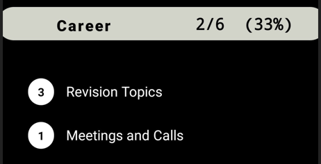

# ToDo Android App 
***
An Android productivity app to manage and track To-Do tasks.

***

## Features

* User can create task groups and then add tasks in it.
* Tasks can be organized into two - **Personal** and **Career**. User can switch between them by clicking on it

  
  
  

***

* New task groups and tasks can be added using the + button in home screen

  

***

* Tap on any task group to view the tasks in that group.
* User can click on a task to mark it as completed. `Completed tasks are strikeout`.
* User can mark a task as '**urgent**' by long pressing the task. `Urgent (top priority) tasks will be marked green`.

  

***

* User can view all urgent tasks in `Urgent Mode`. Urgent mode can be activated by tapping on app name in home screen

  

***

* Tasks and task groups can be edited any time in `Edit Mode`

  

***

* User can check progress in home screen

  

***

## Tools Used

* Language: Java, SQL
* Android Studio
* SQLite

***

